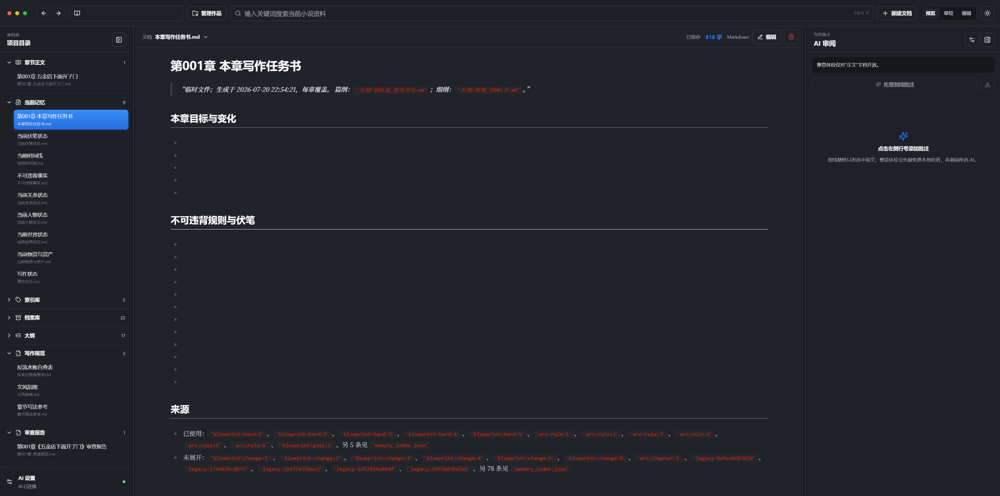
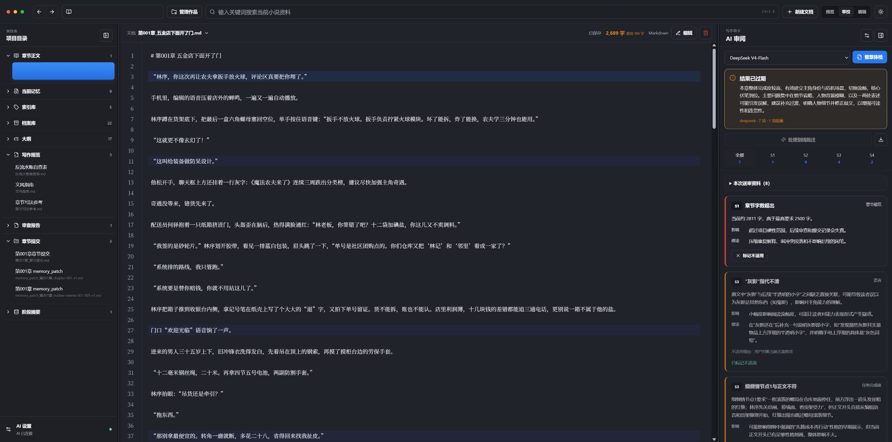
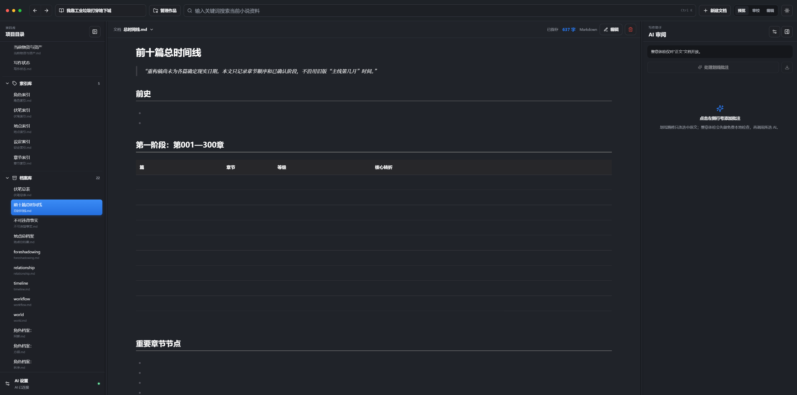
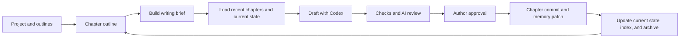

<div align="center">

# Novel Codex Writer

**A local-first AI workspace for long-form web fiction**

Manage multiple novels with structured outlines, chapter review, long-term memory, and a repeatable Codex Agent workflow.

[中文](README.md) · [English](README.en.md) · [Quick Start](docs/quick-start.md) · [Sanitized Demo](examples/demo-novel/) · [Workflow](docs/writing-workflow.md) · [Roadmap](ROADMAP.md)

[](https://github.com/damingishere-coder/novel-codex-writer/actions/workflows/ci.yml)


</div>

> This is not a one-click “generate an entire novel” tool. It is closer to an AI writing operating system: the author remains in control while an agent follows a traceable workflow to organize outlines, prepare context, draft chapters, review issues, and maintain long-term continuity.

## Why this project exists

Generating one chapter is easy. Keeping a long novel consistent is not:

- AI models forget character states, relationships, and unresolved clues over time.
- Outlines, chapters, worldbuilding, and revision notes become fragmented.
- Loading the entire project into every prompt is expensive and creates contradictions.
- Chapters may be readable but still feel repetitive, uneventful, or obviously AI-written.
- Managing several novels at once can cause cross-project contamination.

Novel Codex Writer uses **Markdown as the source of truth**, combined with a current-state projection, rebuildable indexes, structured archives, and a chapter-level workflow.

## Core capabilities

| Capability | What it does |
| --- | --- |
| Multi-project library | Create, switch, rename, and manage multiple novels in one local workspace |
| Long-term continuity | Separate current state, historical archives, indexes, and story-arc snapshots |
| Chapter workflow | Move through outline, context, drafting, review, approval, and memory update |
| Codex Skill | Give Codex explicit rules for selecting context and running project scripts |
| AI-assisted review | Use DeepSeek for fast review or Codex for deeper review, with author approval |
| Local-first storage | Keep manuscripts, settings, and secrets on your own machine |

## Product preview

### Chapter writing brief



### Drafting and AI review



### Story timeline and long-term memory



## How it works



The goal is not unrestricted autonomous generation. The goal is a workflow that can be inspected, corrected, and resumed safely.

## Sanitized demo

The fully fictional [Fog Harbor Letters demo](examples/demo-novel/) shows the complete chain from rough outline to chapter outline, shortened manuscript, review report, chapter commit, memory patch, and current-state projection.

The demo is stored outside the personal library. Real manuscripts belong under `小说项目/作品/`; that directory, `小说项目/projects.json`, and `小说项目/.trash/` are ignored by Git to reduce the risk of publishing private work.

## Quick start

### Requirements

- Windows 10 or 11
- Docker Desktop
- Optional: Codex App or Codex CLI for agent-assisted drafting and deep review
- Optional: a DeepSeek API key for fast review inside the web workspace

### 1. Get the repository

```powershell
git clone https://github.com/damingishere-coder/novel-codex-writer.git
cd novel-codex-writer
```

You may also use **Code → Download ZIP** on GitHub.

### 2. Start the local workspace

From the project directory, double-click:

- `启动网页.bat` to start Docker and open `http://localhost:5173/`
- `关闭网页.bat` to stop local services

The first launch may take a few minutes while Docker builds and downloads dependencies.

### 3. Create your first novel

1. Create a project in the library.
2. Add `大纲/原始大纲.md`.
3. Paste your rough premise, characters, setting, or plot notes.
4. Save the document.

### 4. Initialize it with Codex

Open the repository in Codex and use a prompt such as:

```text
Use the webnovel-writer Skill and read 大纲/原始大纲.md from the active novel.
Do not draft prose yet. Organize the master outline, story-arc outlines, and chapter plan, then initialize the current-state projection and indexes.
```

To begin chapter 1:

```text
Use the webnovel-writer Skill to begin chapter 1.
Confirm the chapter outline and build the writing brief before drafting. Review and revise the chapter, save the approved manuscript, then create the chapter commit and memory patch.
```

The interface and built-in writing rules are currently Chinese-first. English documentation and broader localization are ongoing.

## Who it is for

### Authors

Use the web workspace to manage outlines, chapters, characters, clues, and review reports without operating internal scripts manually.

### Codex and agent users

Use the Skill and helper scripts under `.agents/skills/webnovel-writer/` to select context on demand and execute a repeatable chapter workflow.

### Contributors

Extend the workspace, memory system, chapter checks, model adapters, and export features. Read [CONTRIBUTING.md](CONTRIBUTING.md) before making changes.

## Project data model

Each novel has an isolated directory:

```text
小说项目/作品/<project-id>/
├── 大纲/          # Master, arc, chapter, and scene outlines
├── 写作规范/      # Style and review rules
├── 正文/          # Approved manuscript chapters
├── 章节提交/      # Structured records of chapter changes
├── 审查报告/      # S1-S4 review findings
├── 记忆库/
│   ├── current/   # State that may still affect the next chapter
│   ├── index/     # Rebuildable retrieval index
│   └── snapshots/ # Story-arc summaries
└── 档案库/        # Full history of characters, clues, places, and facts
```

See [Project Structure](docs/project-structure.md) and [Writing Workflow](docs/writing-workflow.md) for details.

## Privacy and repository safety

- Reading, editing, saving, and annotations work without an AI provider.
- DeepSeek keys are stored in a local `.env` file and are never returned by the web API.
- Codex reuses the authenticated state already available on the local machine.
- Environment files, session caches, logs, personal project indexes, manuscripts, and trash data are ignored by Git.
- CI checks tracked files for common secret-like artifacts and personal novel data.
- CI also compiles Python sources and validates the public demo and chapter checker smoke tests.

See [SECURITY.md](SECURITY.md) for reporting and secret-handling guidance.

## Current status

The project is designed for personal, local writing workflows and is still evolving:

- The primary launch path targets Windows and Docker Desktop.
- Codex and DeepSeek are optional; output quality depends on the model and source material.
- Automated checks support the author but do not replace editorial judgment.
- The project intentionally requires human confirmation instead of unattended bulk generation.

See [ROADMAP.md](ROADMAP.md) for planned work and [CHANGELOG.md](CHANGELOG.md) for notable changes.

## Documentation

- [Quick Start](docs/quick-start.md)
- [Sanitized Demo](examples/demo-novel/)
- [Writing Workflow](docs/writing-workflow.md)
- [Project Structure](docs/project-structure.md)
- [Troubleshooting](docs/troubleshooting.md)
- [Contributing](CONTRIBUTING.md)
- [Security](SECURITY.md)

## Contributing

Bug reports, documentation improvements, workflow ideas, and code contributions are welcome. Please read [CONTRIBUTING.md](CONTRIBUTING.md) first, especially before changing project data or memory formats.

## License

Released under the [MIT License](LICENSE).
