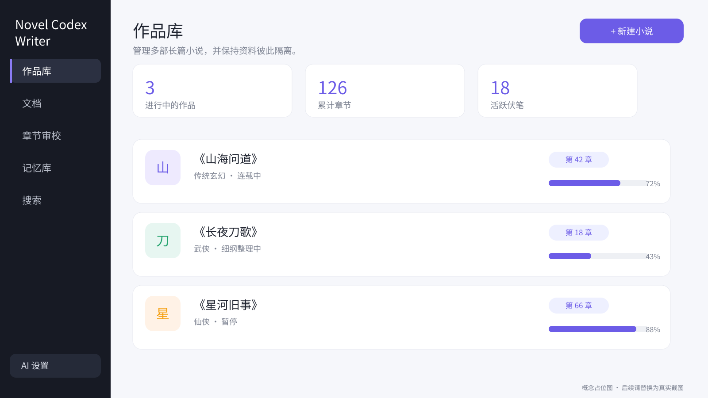
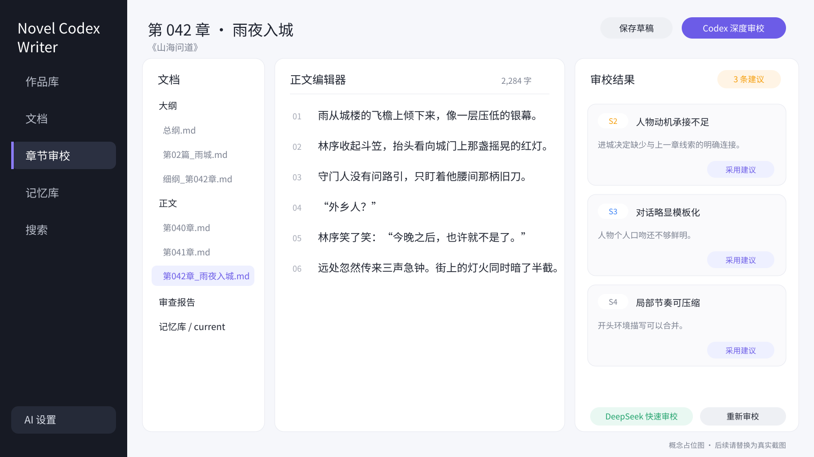
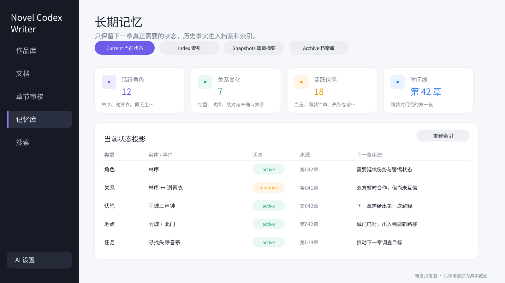

<div align="center">

# Novel Codex Writer

**面向长篇网络小说创作的本地 AI 工作台**

用结构化大纲、章节审查、长期记忆与 Codex Agent 工作流，持续管理和创作多部长篇小说。

[中文](README.md) · [English](README.en.md) · [快速开始](docs/quick-start.md) · [脱敏 Demo](examples/demo-novel/) · [工作流](docs/writing-workflow.md) · [路线图](ROADMAP.md)

[](https://github.com/damingishere-coder/novel-codex-writer/actions/workflows/ci.yml)


</div>

> 这个项目不是“输入一句话，自动吐出整本小说”的生成器。它更像一个 AI 小说创作操作系统：作者保留最终控制权，Agent 按固定流程整理大纲、准备上下文、创作章节、检查问题并维护长期记忆。

## 为什么需要它

长篇 AI 写作真正困难的不是生成一章文字，而是长期保持一致：

- 写到几十章后，AI 容易忘记人物状态、关系和伏笔。
- 大纲、正文、设定和修改记录分散，难以持续管理。
- 每次把全部历史塞进上下文，成本高且容易产生冲突。
- 章节虽然“能读”，却可能流水账、缺少推进或带有明显 AI 腔。
- 多本小说并行时，资料容易串书或相互污染。

Novel Codex Writer 通过 **Markdown 事实源 + 当前状态投影 + 可重建索引 + 章节工作流**，让 Agent 只读取当下真正需要的资料。

## 核心能力

| 能力 | 说明 |
| --- | --- |
| 多作品管理 | 在同一个本地工作台创建、切换、重命名和管理多本小说 |
| 长篇记忆 | 分离当前状态、历史档案、索引与阶段摘要，减少遗忘和冲突 |
| 章节工作流 | 按“细纲 → 上下文 → 正文 → 审查 → 记忆更新”完成每一章 |
| Codex Skill | 让 Codex 按明确规则选择资料、运行脚本并维护作品状态 |
| AI 审校 | 支持 DeepSeek 快速审校和 Codex 深度审校，修改由作者确认 |
| 本地优先 | 小说正文、设定和密钥保存在本机，不依赖云端项目数据库 |

## 产品预览

> 以下为根据当前功能和数据结构制作的概念占位图，并非真实运行截图。后续可直接用相同文件名替换为实际截图，README 无需再次修改。

### 多作品管理



### 正文编辑与 AI 审校



### 长期记忆与当前状态



## 它如何工作


这套流程的重点不是让 AI 自由发挥到失控，而是把创作拆成可检查、可回退、可追踪的步骤。

## 脱敏 Demo

不想先准备自己的小说，可以浏览完全虚构的 [《雾港来信》Demo](examples/demo-novel/)。它展示了：

- 原始大纲与章节细纲如何衔接。
- 正文如何对应 S1-S4 审查报告。
- 章节提交如何记录剧情、人物、关系和伏笔变化。
- memory patch 如何更新 `记忆库/current/`。

Demo 与真实作品目录完全分离。真实小说应保存在本机 `小说项目/作品/`，该目录和 `projects.json`、`.trash/` 已被 Git 忽略，避免误传正文。

## 快速开始

### 环境要求

- Windows 10 / 11
- Docker Desktop
- 可选：Codex App 或 Codex CLI，用于 Agent 深度写作与审校
- 可选：DeepSeek API Key，用于网页中的快速审校

### 1. 获取项目

克隆仓库，或在 GitHub 页面点击 **Code → Download ZIP**：

```powershell
git clone https://github.com/damingishere-coder/novel-codex-writer.git
cd novel-codex-writer
```

### 2. 启动本地工作台

在项目目录双击：

- `启动网页.bat`：启动 Docker 服务并打开 `http://localhost:5173/`
- `关闭网页.bat`：停止本地服务

第一次启动需要 Docker Desktop 拉取和构建依赖，完成后浏览器会进入作品库。

### 3. 创建第一本小说

1. 在作品库中新建小说。
2. 创建 `大纲/原始大纲.md`。
3. 粘贴你的故事构想、人物、世界观或粗略剧情。
4. 保存文档。

### 4. 让 Codex 初始化作品

在 Codex 中打开本仓库，然后输入：

```text
请使用 webnovel-writer Skill，读取当前小说的大纲/原始大纲.md。
先不要写正文，请整理总纲、篇纲和章节规划，并初始化 current 投影与索引。
```

开始写第一章时输入：

```text
请使用 webnovel-writer Skill，开始写第 1 章。
先确认本章细纲并生成写作任务书，再写正文；完成审查和修改后保存正文，并生成章节提交与 memory patch。
```

更完整的安装、AI 配置和首次运行说明见 [快速开始](docs/quick-start.md)。

## 面向谁

### 小说作者

通过网页管理大纲、正文、人物、伏笔和审查结果，不需要手动理解全部脚本。

### Codex / Agent 用户

通过 `.agents/skills/webnovel-writer/` 中的 Skill 规则和脚本，按需读取资料并执行稳定的章节流程。

### 开发者与贡献者

可以扩展网页工作台、记忆机制、章节检查器、模型适配器和导出能力。开始前请阅读 [贡献指南](CONTRIBUTING.md)。

## 作品数据结构

每本小说拥有独立目录，避免跨作品读取：

```text
小说项目/作品/<项目ID>/
├── 大纲/          # 原始大纲、总纲、篇纲、章节规划与章节细纲
├── 写作规范/      # 文风、审查和章节写法规则
├── 正文/          # 最终确认的章节正文
├── 章节提交/      # 每章发生了什么、改变了什么
├── 审查报告/      # S1-S4 章节检查与修改建议
├── 记忆库/
│   ├── current/   # 下一章仍可能生效的当前状态
│   ├── index/     # 可删除、可重建的检索索引
│   └── snapshots/ # 篇章阶段摘要
└── 档案库/        # 角色、伏笔、地点、设定与事实的完整历史
```

详细说明见 [项目结构](docs/project-structure.md) 和 [写作工作流](docs/writing-workflow.md)。

## AI、隐私与仓库安全

- 未配置任何 AI 服务时，阅读、编辑、保存和批注仍可使用。
- DeepSeek 密钥只保存在本机 `.env`，网页 API 不返回真实密钥。
- Codex 使用本机已有登录状态，不需要把账号凭据写入仓库。
- `.env`、会话缓存、日志和构建产物已被 Git 忽略。
- `小说项目/projects.json`、`小说项目/作品/` 和 `小说项目/.trash/` 默认不会提交到公共仓库。
- GitHub Actions 会检查敏感文件、个人作品数据、Demo schema 和 Python 基础可运行性。

安全问题与密钥泄漏处理方式见 [SECURITY.md](SECURITY.md)。

## 当前状态与限制

当前版本面向本地个人创作，仍处于持续迭代阶段：

- 主要启动流程针对 Windows + Docker Desktop。
- Codex 和 DeepSeek 均为可选能力，实际输出质量取决于模型与作者资料。
- 章节检查能发现确定性问题和常见写作问题，但不能替代作者判断。
- 项目强调人工确认，不以无人值守批量生成整本小说为目标。

计划中的能力见 [ROADMAP.md](ROADMAP.md)，版本变化见 [CHANGELOG.md](CHANGELOG.md)。

## 文档

- [快速开始](docs/quick-start.md)
- [脱敏 Demo](examples/demo-novel/)
- [完整写作工作流](docs/writing-workflow.md)
- [项目目录与数据说明](docs/project-structure.md)
- [常见问题与排错](docs/troubleshooting.md)
- [贡献指南](CONTRIBUTING.md)
- [安全说明](SECURITY.md)

## 参与贡献

欢迎提交 Bug、文档改进、工作流建议和代码贡献。为了避免破坏小说数据与记忆兼容性，请先阅读 [CONTRIBUTING.md](CONTRIBUTING.md)。

## License

本项目采用 [MIT License](LICENSE)。

如果这个项目对你的长篇创作有帮助，欢迎点一个 Star，让更多作者发现它。
